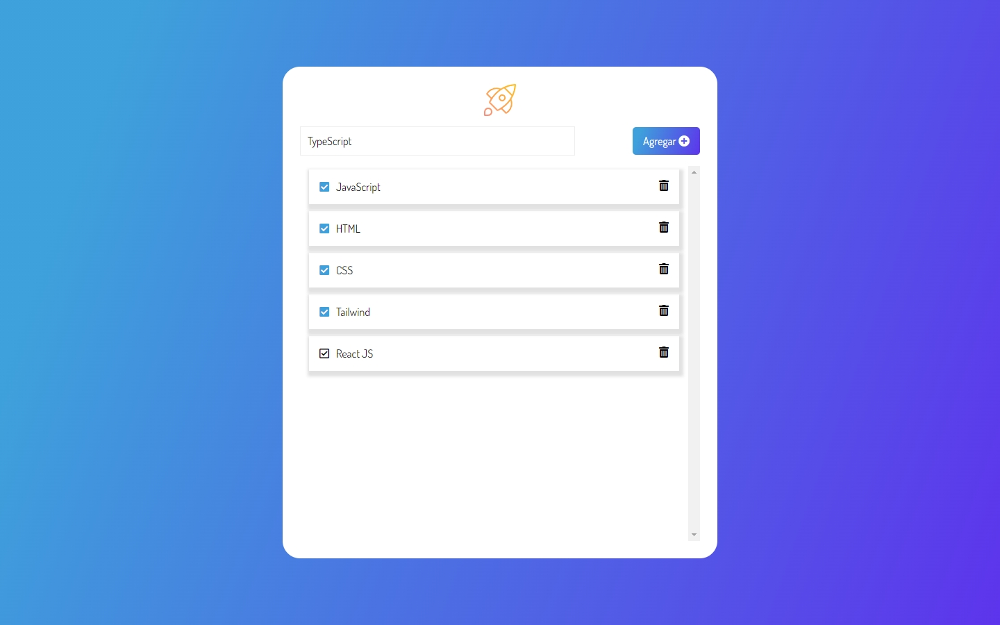

 
  <h1>TODO App</h1>

 
   
  
  

## Description

A simple TODO application to manage your daily tasks efficiently. Add new tasks, mark them as completed, and remove them once done.

## Key Features

- **Add Task**: Quickly add new tasks to your TODO list.
- **Remove Task**: Delete tasks that are no longer needed.
- **Mark as Complete**: Mark tasks as completed by clicking the check icon.

## Screenshots

  

## Additional Information

- This project was part of the Alura Latam bootcamp.
- Developed by Evelin Alvarado.
- Find me on [GitHub](https://github.com/EvelinAlvarado) and [LinkedIn](https://www.linkedin.com/in/evelinalvarado/).

Check out the live project: [TODO App](https://evelinalvarado.github.io/task-list-dom-js-project-alura-oracle/)
